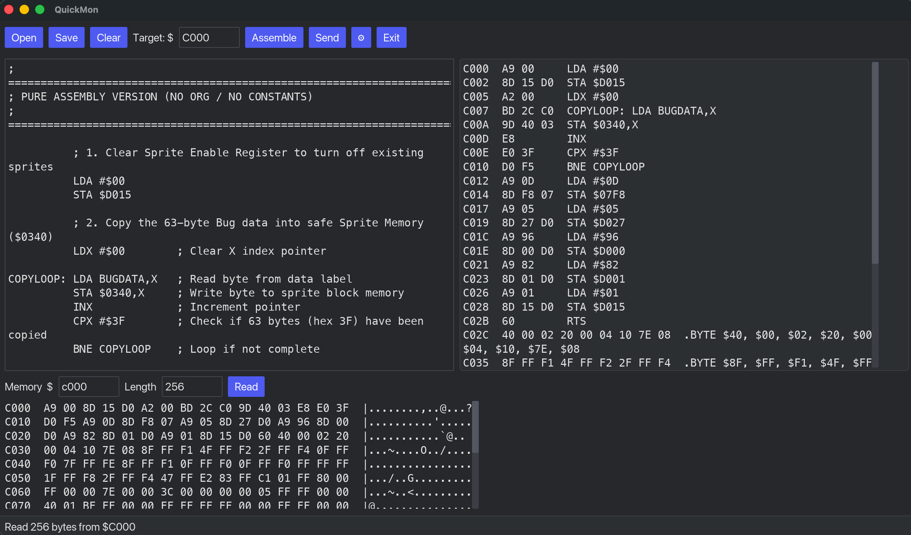

# QuickMon

Write 6510 assembly on your desktop, assemble it, and write the machine code
straight into the memory of a **Commodore 64 Ultimate** over its REST API.

QuickMon does not try to run your code. Its job ends when the bytes are
confirmed present at the address you asked for — you start them yourself with
`SYS` from BASIC, or from the machine's own monitor.



## What it does

- **Assembles 6510** — all 56 documented mnemonics, all 13 addressing modes,
  labels, `.byte` / `.word`, and `;` comments.
- **Writes to the device** over `POST /v1/machine:writemem`, then reads the same
  range back and compares it byte for byte. The status bar says `verified` only
  on an exact, full-length match; any difference is reported neutrally as a
  `Read-back mismatch` with the address and both bytes.
- **Reads memory** back off the machine as a hex dump, so you can look at screen
  RAM, sprite data, or the routine you just sent. The character column reads as
  **ASCII**, **PETSCII**, or **screen codes**, whichever you pick.

There is no file output: QuickMon assembles into memory and sends. If you
want a `.prg`, or want to drive this from a script, use the command-line
companion — [termon](https://github.com/chadlung/termon), described
[below](#termon--the-same-job-from-the-command-line).

## Requirements

- Rust 1.88 or newer (built and tested on 1.94.1, edition 2024)
- A **Commodore 64 Ultimate** reachable on your network, with its REST API enabled
- Official Commodore firmware **v1.1.0 or newer** — the REST API QuickMon talks to
  does not exist on earlier releases. Download it from
  [commodore.net/downloads](https://commodore.net/downloads/).
- macOS, Linux, or Windows

## Build and run

```sh
cargo run --release
```

A binary you built yourself is never blocked by any of the following. If you
would rather not deal with the operating system's warnings at all, this is the
short way past them.

## Running a downloaded release

Release archives are published on the
[Releases page](https://github.com/chadlung/quickmon/releases): a `.tar.gz` for
macOS and Linux, a `.zip` for Windows. Pick `macos-arm64` for Apple Silicon
(M1 and later) or `macos-x86_64` for an Intel Mac.

**These binaries are not code-signed.** Signing them would mean paying for an
Apple Developer certificate and a Windows code-signing certificate, so both
operating systems treat QuickMon as software from an unidentified developer and
will refuse to run it until you say otherwise. That refusal is about the absence
of a certificate, not about anything found in the program. Everything below is
how to grant that permission — or, if you would rather not, build from source
instead.

### macOS

The archive holds a plain `quickmon` executable rather than a `.app` bundle, so
Terminal is the least fussy route:

```sh
tar -xzf quickmon-v1.0.0-macos-arm64.tar.gz
cd quickmon-v1.0.0-macos-arm64
xattr -d com.apple.quarantine quickmon 2>/dev/null
./quickmon
```

Your browser tags anything it downloads with a `com.apple.quarantine`
attribute, and Gatekeeper reads that tag to decide whether to intervene. The
tag lands on the `.tar.gz`, and **both** ways of unpacking it carry the tag
across to the files inside — `tar` on macOS restores extended attributes, and
Finder's Archive Utility propagates them too. So the `xattr -d` line is not
optional tidying; without it the extracted binary is still quarantined. Run it
after unpacking and before the first launch. If the tag has already been
cleared the command prints `No such xattr` and changes nothing, which is what
the `2>/dev/null` is absorbing.

If you launch it from Finder instead, macOS refuses with a message to the
effect of **"Apple could not verify 'quickmon' is free of malware"** (the exact
wording moves between releases):

- **macOS 15 (Sequoia) and newer** — open **System Settings → Privacy &
  Security**, scroll down to the Security section, and click **Open Anyway**
  beside the blocked item. Then launch it again. The old Control-click
  shortcut no longer works here; Apple removed that bypass for un-notarized
  software in Sequoia.
- **macOS 14 (Sonoma) and older** — Control-click (or right-click) the
  binary, choose **Open**, then **Open** again in the dialog that follows.
  Doing it this way once is remembered.

### Windows

Windows has three separate mechanisms here, and they are worth telling apart
because only two of them can be waved through.

**1. Mark of the Web — unblock the `.zip` before extracting.** Right-click the
downloaded archive, choose **Properties**, tick **Unblock** at the bottom of
the General tab, and click OK. Do this *first*: extracting a still-blocked
archive stamps every file inside it, and you will be answering the same prompt
afterwards. In PowerShell:

```powershell
Unblock-File -Path .\quickmon-v1.0.0-windows-x86_64.zip
```

**2. Microsoft Defender SmartScreen — "Windows protected your PC".** A blue
dialog with a single **Don't run** button. The way through is the quiet link:
click **More info**, which reveals a **Run anyway** button beneath it.

**3. Smart App Control — this one cannot be waved through.** Smart App Control
is a separate Windows 11 feature from SmartScreen, and where SmartScreen asks,
it simply blocks. It refuses unsigned binaries outright and offers no per-app
override, so there is no "Run anyway" to find.

Check **Windows Security → App & browser control → Smart App Control** to see
whether it is On, Off, or in Evaluation mode. If it is On, be aware that
turning it off is a one-way door — Windows will not let you switch it back on
without reinstalling the operating system. Weakening a system-wide security
setting for one program is a poor trade, so if Smart App Control is on, the
better answer is to build QuickMon from source with `cargo run --release`. A
binary compiled on your own machine is not subject to it.

### Linux

No signature checks to work around. The tarball preserves the executable bit,
so extract and run it:

```sh
tar -xzf quickmon-v1.0.0-linux-x86_64.tar.gz
cd quickmon-v1.0.0-linux-x86_64
./quickmon
```

## Using it

### 1. Connect

QuickMon opens with the settings panel showing and the cursor in the **Host**
field. You will need to enter a valid IP address to your networked Commodore 64
Ultimate.

**Neither the host nor the password is ever written to disk.** Both are typed
each run and live only in memory for the lifetime of the process. Nothing about
your connection is stored anywhere, so there is no config file to leak and no
saved setting that can silently fail to persist.

Type the device's IP and press **Connect**. On success the message turns green,
moves to the status bar, and the panel closes:

```
Connected — C64 Ultimate, firmware 1.1.0 (API 0.1)
```

On failure it stays put in red so you can correct the field it is complaining
about.

### 2. Write some assembly

Type into the left pane, or **Open** a `.asm` file.

```asm
        LDA #$93        ; clear the screen
        JSR $FFD2
        LDA #$08        ; screen code for "H"
        STA $0400
        LDA #$01        ; white
        STA $D800
        RTS
```

Tab indents. The editor is monospace, and mnemonics are uppercased for you when
you assemble.

### 3. Assemble

Set **Target: $** to the address the code should live at — `C000` is the usual
choice, being 4K of RAM that BASIC never touches — and press **Assemble**.

The right pane fills with a listing showing, for each line, the address, the
bytes emitted, and the source that produced them:

```
C000  A9 93     LDA #$93
C002  20 D2 FF  JSR $FFD2
C005  A9 08     LDA #$08
```

The status bar gives the size and the origin in both bases, because the decimal
form is what you will type into `SYS`:

```
29 bytes assembled at $C000 (49152)
```

If assembly fails, the right pane shows the errors instead, each with its line
number:

```
line 4: unknown mnemonic 'LDZ'
line 7: branch to 'loop' is -142 bytes, limit is -128 to +127
```

### 4. Send

Press **Send**. QuickMon writes the bytes, reads the same range back, and
compares:

```
29 bytes written to $C000 (49152) — verified
```

If the read-back disagrees it tells you exactly where:

```
Read-back mismatch at $C003: sent D2, read back 00
```

### 5. Run it on the C64

QuickMon deliberately does not start your code. On the Commodore 64:

```basic
SYS 49152
```

### Reading memory back

The bottom pane reads any range off the device. Enter an address and a length
(1–65536) and press **Read**:

```
C000  A9 93 20 D2 FF A9 08 8D 00 04 A9 09 8D 01 04 A9  |... .............|
C010  01 8D 00 D8 8D 01 D8 A9 0D 20 D2 FF 60 00 00 00  |......... ..`...|
```

#### Character modes

The dropdown beside **Read** chooses how the right-hand character column is
interpreted. It changes nothing else: **the address and hex columns are
identical in every mode**, and switching modes re-reads the bytes you already
have rather than going back to the device.

| Mode | Reads each byte as | `A` is |
|---|---|---|
| **ASCII** | printable host ASCII, `$20-$7E` | `$41` |
| **PETSCII** | what `PRINT CHR$(X)` draws | `$41` |
| **Screen codes** | what screen RAM holds, as `PEEK` returns it | `$01` |

That last row is the whole point. The same two bytes mean different things
depending on which system you are reading:

```
                                 ASCII / PETSCII      Screen codes
0400  48 49 08 09 ...            |HI..|              |..HI|
```

`$48 $49` is `HI` to `PRINT`; `$08 $09` is `HI` sitting in screen RAM. Pick the
mode that matches what you are looking at — QuickMon will not guess, because it
cannot: screen RAM is movable, and what any address exposes depends on the
machine's banking state.

Bytes with no honest rendering — C64 graphic glyphs, reverse-video codes, and
control codes — show as `.`, the same placeholder the ASCII column has always
used for unprintable bytes. Reverse video is deliberately *not* shown as its
un-reversed letter: screen code `$81` is a reversed `A`, and drawing it as a
plain `A` would misreport the screen. The hex column beside it is always the
unambiguous reading.

Both C64 tables are for the **uppercase/graphics character set**, which is what
the machine powers on with. They are transcribed from the *Commodore 64
Programmer's Reference Guide* — Appendix B for screen codes, Appendix C for
PETSCII — and are checked against those tables in `src/ui/charmap.rs`.

## Demos

`demos/` holds small, self-contained 6510 programs to open, assemble, and send.
None of them set an origin or use constants, so the **Target: $** field alone
decides where they land — assemble at `C000` and start them with `SYS 49152`.
Every one exits on a keypress and leaves the machine on a normal blue screen.

| File | What it does |
|------|--------------|
| `hello.asm` | Prints HELLO centred on the screen and recolours each letter at random. |
| `linetext.asm` | Draws a white line across the middle of the screen in text mode. |
| `line.asm` | The same line in hi-res bitmap mode, bitmap at `$2000`. |
| `sprite.asm` | A two-frame animated sprite bouncing left and right. |
| `togglecolor.asm` | RETURN steps the background through the 16 colours; any other key quits. |
| `dots.asm` | Sprinkles random coloured `.` characters across the screen. |

Several of them use SID voice 3 as a random number generator: with the noise
waveform running at a high frequency, `$d41b` returns a fresh pseudo-random byte
on every read, and `$d418` bit 7 keeps that voice out of the audio output.

## Assembly syntax

| | |
|---|---|
| Mnemonics | All 56 documented 6510 instructions, case-insensitive |
| Addressing | All 13 modes, detected from the operand form |
| Numbers | `$FF` hex, `255` decimal, `%11111111` binary |
| Labels | `loop:` or `loop`, **case-sensitive** — `loop` and `LOOP` are different symbols |
| Directives | `.byte $01,$02` and `.word $1234` |
| Comments | `;` to end of line |
| Width override | `.b` forces zero-page addressing, `.w` forces absolute — see below |

### `.b` and `.w` force an address width

`.b` selects zero page, zero page,X or zero page,Y. `.w` selects absolute,
absolute,X, absolute,Y or indirect. A suffix either selects a mode of that class
or the assembly fails — it is never silently ignored:

```asm
LDA.b $10       ; A5 10
LDA.w $10       ; AD 10 00      absolute, one cycle slower, one byte longer
JMP.w ($10)     ; 6C 10 00      indirect carries a 16-bit address
JMP.b $10       ; error — JMP has no zero-page form
STX.w $10,Y     ; error — STX has zero page,Y but no absolute,Y
LDA.b #$10      ; error — an immediate operand carries no address
RTS.w           ; error — an implied instruction carries no address
BNE.b target    ; error — a branch is relative, neither zero page nor absolute
```

The suffix names an *address width*, not the number of operand bytes. Immediate,
implied, accumulator, relative, `(indirect,X)` and `(indirect),Y` carry no
address, so neither suffix applies to them.

### Operand widths are resolved, not guessed

Most simple assemblers assume a forward-referenced label is absolute, which
quietly costs a byte whenever the target turns out to be in zero page. QuickMon
runs a fixpoint instead: every ambiguous operand starts at its narrowest legal
encoding and only ever widens, repeating until nothing changes. Widths only
grow, which is what makes it terminate.

The result is that reference direction does not affect output — a
forward-referenced zero-page label assembles exactly as a backward-referenced
one does.

`.b` and `.w` are there for when you want to override that: absolute addressing
of a low address costs an extra cycle, and some code depends on that timing.

## Things worth knowing

**No address is refused.** QuickMon is an experimentation tool. It will send to
any address you assemble to, including `$0000`/`$0001` — the 6510's on-chip
I/O port, which the Ultimate's documentation says cartridge-bus DMA cannot
reach. You are entitled to issue the request and see what the device actually
reports, which is more informative than a refusal that only guesses. The one
limit kept is structural, not editorial: a write or read must not run past
`$FFFF`, because the API prohibits it.

**`verified` means the bytes match, nothing more.** An exact, full-length byte
match is reported as `verified`; any difference is a neutral
`Read-back mismatch` giving the address, the byte sent and the byte returned.
A mismatch is not proof of user error or of an unsafe address, and equality is
not proof that an I/O register performed a side effect — it says only that the
returned byte equalled the sent byte under the hardware and memory
configuration active at that moment.

**Writes use the machine's currently selected memory map**, so what an address
exposes depends on the C64's banking state at that moment:

- `$D000-$DFFF` may expose I/O, character ROM, or RAM depending on banking.
- In the usual I/O-visible configuration, displayed Color RAM is
  `$D800-$DBE7` and uses only the low nibble; upper-nibble read-back is
  undefined, and `$DBE8-$DBFF` is unused. QuickMon does not mask the upper
  bits — the same address exposes RAM in another bank configuration, and the
  raw bus value is the useful thing here.
- `$C000-$CFFF` is RAM in the normal no-cartridge configuration, but cartridge
  and Ultimax configurations change what is mapped and can leave regions
  unmapped.

These are facts about the hardware, not rules QuickMon enforces.

**A bad address fails in about five seconds.** The connect timeout is bounded so
a typo in the host field costs a pause rather than the operating system's full
TCP retry schedule.

**The editor has no scrollbar.** It scrolls with the mouse wheel and follows the
cursor, but iced 0.14's `text_editor` has no scrollbar support to enable.

## termon — the same job from the command line

[**termon**](https://github.com/chadlung/termon) is QuickMon's companion
project: the same work — assemble 6510, write the machine code into a
Commodore 64 Ultimate over its REST API — with no window. It is a separate
program, not a mode of this one, and the two are independent: neither needs the
other installed.

Reach for termon instead of QuickMon when you want to:

- **Build a `.prg`.** termon writes a standard C64 program file with the load
  address in the first two bytes, so the result runs from disk or an emulator.
  QuickMon has no file output at all — it assembles into memory and sends.
- **Script it.** `termon assemble`, `send`, `read`, and `info` are subcommands
  with distinct exit codes — `1` usage, `2` assembly failure, `3` network
  error, `4` verification mismatch — so a shell script or CI job can tell the
  four apart without parsing text.
- **Work over SSH,** or anywhere else a GUI is not available.

Stay with QuickMon when you want the editor, the error list beside the source,
and the hex dump you can flip between ASCII, PETSCII, and screen codes without
re-running anything.

## Development

```sh
cargo test                  # 164 tests
cargo build --all-targets   # warning-free
```

The code is layered so the parts with real logic can be tested without a window
or a C64:

```
src/asm/     assembler — pure, no I/O, no GUI
src/net/     REST client — no GUI, tested against a mock HTTP server
src/ui/      formatting helpers and the character-code tables
src/app.rs   iced State / Message / update / view
```

`tests/golden.rs` pins the assembler's output for a known program against bytes
that were verified running on real hardware.

`docs/manual-test.md` is the end-to-end checklist against an actual device —
every other test uses mocks or an emulator, so that document is the only thing
that exercises the real path.

## Licence

GNU General Public License v3.0 or later (GPL-3.0-or-later).
